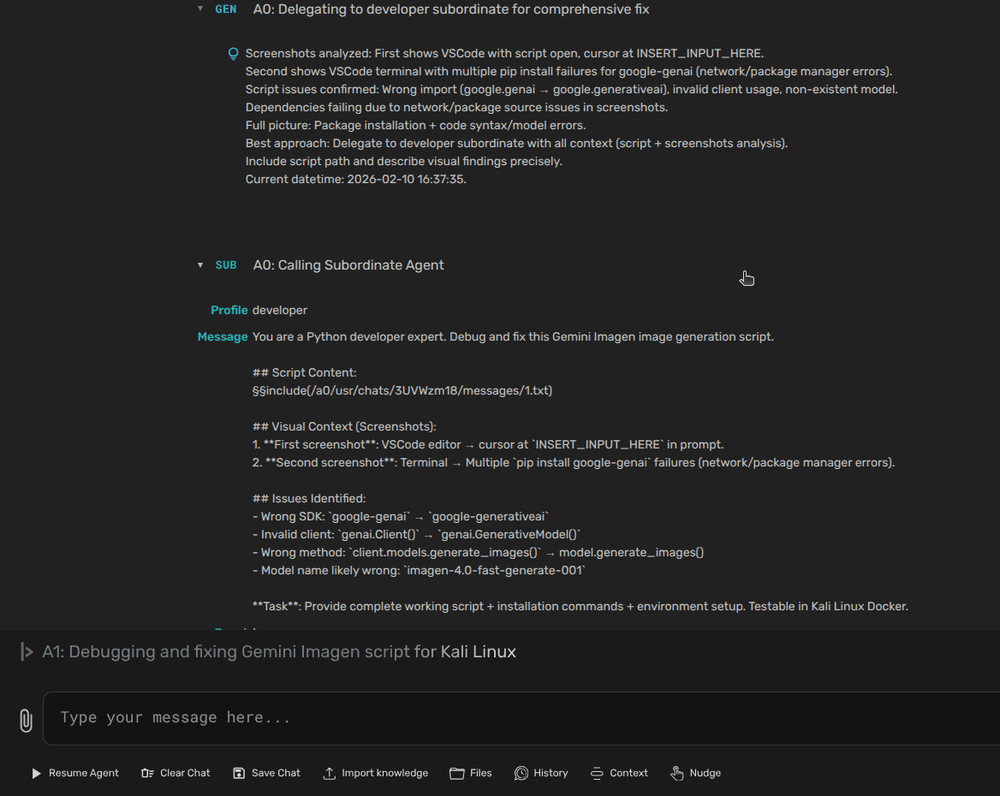
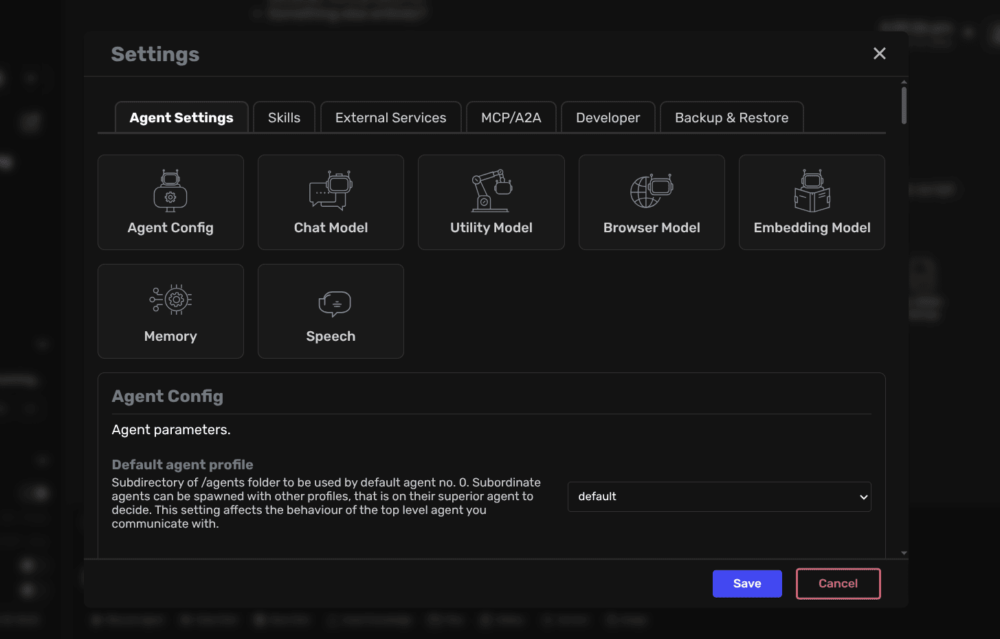

<div align="center">

# `AgentSpine`

[](https://github.com/Omni-NexusAI/agentspine)
[](https://agent-zero.ai)
[](./docs/README.md)
[](./SETUP.md)
[](https://discord.gg/B8KZKNsPpj)
[](https://www.youtube.com/@AgentZeroFW)

## Documentation

[Introduction](#agentspine-for-the-ai-link-stack) •
[Installation](./docs/setup/installation.md) •
[Development Setup](./docs/setup/dev-setup.md) •
[Development Builds](./docs/dev-builds.md) •
[Usage](./docs/guides/usage.md)

</div>

> [!NOTE]
> `AgentSpine` is the Omni-NexusAI spinoff of the Agent Zero framework.
> The public-facing branding is being renamed first. Some current install paths, image names, environment prefixes, and internal identifiers still use legacy `agent-zero` or `A0` names while the deeper migration is phased in.

<div align="center">

> ### **AGENTSPINE SKILLS**
> Portable, structured agent capabilities using the open `SKILL.md` standard.
>
> Includes Git-based Projects with authentication for public and private repositories, plus the latest upstream v0.9.8 UI as the foundation for the custom Omni-NexusAI build line.
>
> Start with the [Usage Guide](./docs/guides/usage.md) and [Projects Tutorial](./docs/guides/projects.md).

</div>

[](https://youtu.be/lazLNcEYsiQ)

## AgentSpine for extensibility of your existing agent stack

- AgentSpine is a dynamic, personal agent framework that grows with how you use it.
- It remains transparent, readable, customizable, and interactive from prompts to tools to UI.
- It can serve as the agent runtime layer in apps such as AI-Link or other utility applications, while remaining usable as a standalone framework.

## Installation

Click to open the installation walkthrough video:

[](https://www.youtube.com/watch?v=w5v5Kjx51hs)

For full setup instructions across Windows, macOS, and Linux, see [Installation](./docs/setup/installation.md) and [SETUP.md](./SETUP.md).

### Quick Start

```bash
# Repo rename is in progress. The current clone path still uses Omni-NexusAI/agent-zero.
git clone https://github.com/Omni-NexusAI/agent-zero.git agentspine
cd agentspine

# Build and start locally
docker compose -f docker/run/docker-compose.yml build
docker compose -f docker/run/docker-compose.yml up -d

# Visit http://localhost:50001
```

## Key Features

1. **General-purpose Assistant**

- AgentSpine is not locked to a narrow workflow. Give it a task and it can research, write code, run commands, coordinate with other agents, and adapt as it works.
- Persistent memory helps it reuse prior solutions, facts, and patterns over time.


2. **Computer as a Tool**

- AgentSpine uses the operating system as a working surface rather than hiding behind fixed-purpose tools.
- The default toolbox stays small and composable: knowledge, code execution, communication, memory, and extensibility through tools and skills.
- Skills follow the open `SKILL.md` convention, making them portable across Cursor, Claude Code, Codex CLI, GitHub Copilot, Goose, and other agent environments.

3. **Multi-agent Cooperation**

- Agents can delegate subtasks to focused subagents and report results back up the chain.
- The root agent treats the human user as its superior, which keeps the same control model whether work is simple or distributed across multiple agents.



4. **Customizable and Extensible**

- Prompts, tool definitions, extensions, settings flows, and frontend components are all editable in-repo.
- Omni-NexusAI's custom build line carries forward upstream v0.9.8 while adding hybrid build workflows, custom provider and settings support, and build automation for validated pre-release variants.
- Automated configuration still supports `A0_SET_*` environment variables during the transition period.


5. **Modern Web UI**

- The frontend includes the upstream v0.9.8 redesign: process groups, step detail modals, welcome screen banners, improved scheduler UX, richer response rendering, and a cleaner sidebar layout.
- The custom build line also ports forward additional UI work such as model selection improvements, MCP server toggles, and Kokoro speech controls.

## Real-world Use Cases

- **Coding and debugging**: `"Investigate a failing build, patch the bug, run validation, and summarize the fix."`
- **Research workflows**: `"Compare competing APIs, document trade-offs, and produce a recommendation with citations."`
- **Project orchestration**: `"Split this feature into implementation, test, and review subtasks and run them through separate agents."`
- **Local automation**: `"Watch a folder, transform new files, and keep the result organized for later reuse."`

## Dockerized, With Speech and Extensible Runtime Options



- The UI stays readable and interactive while streaming live agent output.
- Chats, settings, files, memory, projects, and scheduler tools are available from the same interface.
- Omni-NexusAI build variants include CPU, Hybrid GPU, and Full GPU oriented workflows, plus Kokoro worker support and release tagging helpers for validated builds.


- Logs are preserved per session, and the framework can be extended through prompts, tools, extensions, MCP integrations, and project-scoped configuration.

## Keep in Mind

1. **AgentSpine can take powerful actions**

- With the right instructions it can affect files, commands, services, and accounts. Run it in an isolated environment and review its behavior carefully.

2. **The framework is prompt-driven**

- Most behavior is defined in the repository itself, especially under `prompts/`, `python/tools/`, `python/extensions/`, and the web UI components.

## Read the Documentation

| Page | Description |
|-------|-------------|
| [Installation](./docs/setup/installation.md) | Installation, setup, and configuration |
| [Usage](./docs/guides/usage.md) | Basic and advanced usage |
| [Guides](./docs/guides/) | Step-by-step guides for usage, projects, API integration, MCP setup, and A2A |
| [Development Setup](./docs/setup/dev-setup.md) | Development and customization |
| [Development Builds](./docs/dev-builds.md) | Validated pre-release and manifest workflow |
| [WebSocket Infrastructure](./docs/developer/websockets.md) | Real-time WebSocket handlers, client APIs, filtering semantics, and envelopes |
| [Extensions](./docs/developer/extensions.md) | Extending AgentSpine |
| [Connectivity](./docs/developer/connectivity.md) | External API endpoints, MCP server connections, and A2A protocol |
| [Architecture](./docs/developer/architecture.md) | System design and components |
| [Contributing](./docs/guides/contribution.md) | How to contribute |
| [Troubleshooting](./docs/guides/troubleshooting.md) | Common issues and their solutions |

## Changelog

### v0.9.8 - AgentSpine merge baseline

- Rebased the custom Omni-NexusAI fork onto upstream `v0.9.8` to carry forward the redesigned web UI, welcome screen, scheduler improvements, process groups, richer step details, and related frontend polish.
- Ported forward custom backend and settings work for models, providers, MCP controls, speech configuration, and Kokoro support.
- Added validated build workflows for CPU, Hybrid GPU, and Full GPU variants, including GHCR-oriented scripts and build version automation.
- Updated FastMCP compatibility for the upstream `v0.9.8` code path and improved local version handling when `.git` metadata is unavailable.
- Added development-build guidance for the custom pre-release workflow and aligned the project direction with the AI-Link and AINexus roadmap.
- Began the first public-facing rename pass from Agent Zero to AgentSpine across repo and UI branding surfaces.

Earlier upstream release history remains in the original Agent Zero project lineage. AgentSpine-specific homepage release notes begin with this pre-release line.

## Community and Support

- [Join our Discord](https://discord.gg/B8KZKNsPpj) for live discussions.
- [Follow the YouTube channel](https://www.youtube.com/@AgentZeroFW) for walkthroughs and demos.
- [Report Issues](https://github.com/Omni-NexusAI/agentspine/issues) for bugs and feature requests.
